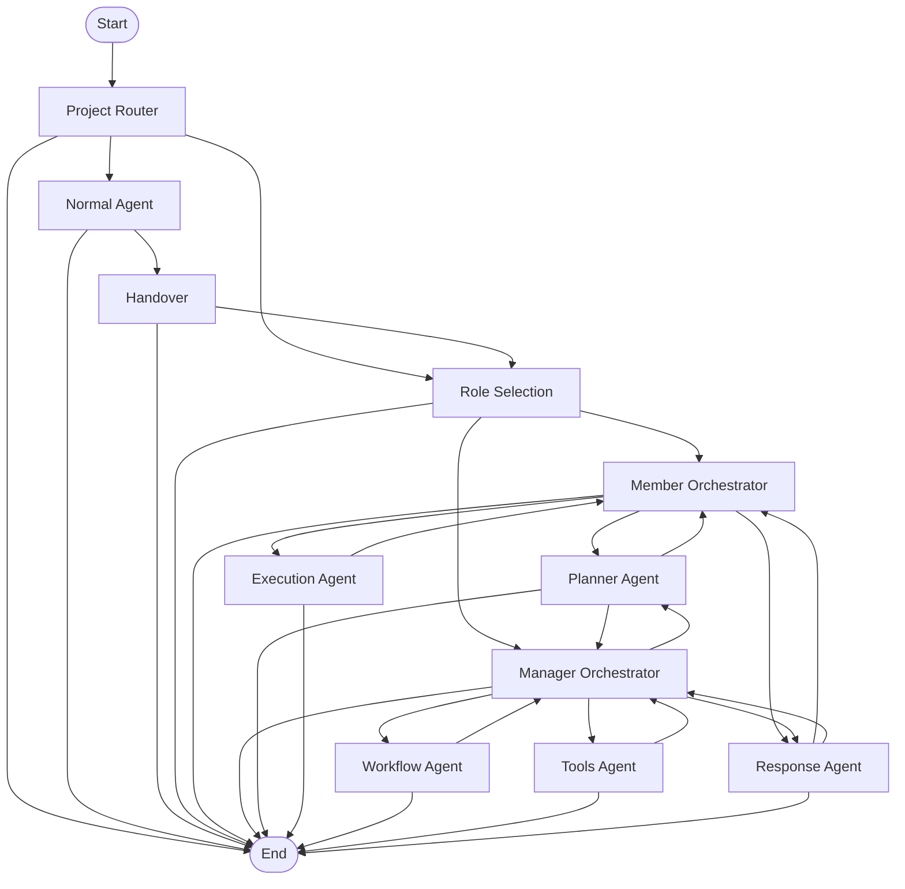

# Orchestra


## 🎯 Overview

Orchestra is a Slack-native agentic platform for project management, workflow automation, and knowledge retrieval. Users interact with the system through natural language while Orchestra plans and executes the required actions.

Built on LangGraph, Orchestra uses a graph-based multi-agent architecture to coordinate planning, execution, workflow orchestration, and response generation. A separate, dedicated Python service handles all vector operations and RAG context management.

Key characteristics:

* Graph-based agent orchestration
* Workflow-first execution
* Role-aware access control
* Context-aware knowledge retrieval
* Slack-native user experience

## 🎯 Motivation

As projects grow, project knowledge becomes scattered across channels, administrative tasks become repetitive, and retrieving information becomes increasingly difficult.

Orchestra introduces a unified conversational interface that brings together project management, workflow automation, and knowledge retrieval.

The platform allows users to describe what they want to accomplish in natural language, elegantly handling the planning, authorization, execution, and context retrieval behind the scenes.

## 🏗️ High-Level Architecture

Orchestra follows a two-service architecture that cleanly separates orchestration from knowledge management.

### Orchestration Service (Node.js)

This core service manages the user experience and graph execution. It handles:

* Slack integration and event processing
* Agent orchestration through LangGraph
* Workflow and tool execution
* Authorization, role management, and caching

### Context Retrieval Service (Python)

This dedicated service isolates vector operations from the orchestration logic. It handles:

* Document and update ingestion
* Semantic context retrieval
* Vector database interactions

## 🔄 Request Lifecycle

Every request received by Orchestra follows a graph-based execution flow.

1. A user sends a message in Slack.
2. Slack Events API forwards the event to the Orchestra backend.
3. Project context and user permissions are evaluated.
4. The request is routed to the appropriate orchestrator.
5. The task is planned, executed, and validated.
6. A final response is generated and returned to Slack.

```text
Slack Event
      │
      ▼
Project Router
      │
      ▼
Role Selection
      │
 ┌────┴────┐
 ▼         ▼
Member   Manager
Orchestrator
      │
      ▼
Planner Agent
      │
      ▼
Execution Layer
      │
      ▼
Response Agent
      │
      ▼
Slack Response

```

## 🏛️ Key Architectural Features

Orchestra is designed around a set of architectural principles that prioritize reliability, maintainability, and controlled agent execution.

* **Graph-Based Agentic Architecture:** Execution is modeled as a stateful LangGraph graph, enabling structured, flexible, and predictable execution transitions.
* **Planner-Executor Pattern:** A dedicated Planner Agent carefully decomposes the user's request into actionable subtasks to ensure an organized and methodical execution.
* **Workflow-First Execution:** For manager-level operations, Orchestra prioritizes predefined workflows. This keeps execution deterministic, provides a consistent experience, and optimizes token usage.
* **Stateful Execution:** Graph state tracks planning progress, completed subtasks, and execution results throughout the request lifecycle.
* **Partial Failure Tolerance:** The system evaluates whether remaining subtasks can proceed independently of previous steps, continuing execution to maximize the value provided to the user.

## ⭐ LangGraph Execution Flow

Every request is executed through a stateful LangGraph workflow responsible for project resolution, authorization, planning, and execution.



### Execution Phases

* **Discovery & Routing:** The Project Router attempts to identify the target project via channel or thread metadata. If additional context is needed, the Normal Agent interacts with the user to establish it before safely passing execution through the Handover node.
* **Authorization:** The Role Selection node determines if the user is a Member or Manager, routing them to the appropriate orchestrator.
* **Planning:** The Planner Agent breaks the request into a structured list of subtasks manageable by the available tools.
* **Execution:** The Member Orchestrator routes tasks to a single Execution Agent. The Manager Orchestrator routes tasks through the Workflow Agent first, engaging the Tools Agent for highly specialized operations.
* **Response:** The Response Agent receives the full execution trajectory, summarizing the completed actions into a concise, Slack-ready reply.

## 🔍 System Deep Dive

<!-- Defines the purpose and responsibilities of the specialized execution agents -->
### 🧩 Agent Architecture

Orchestra uses six specialized agents, each responsible for a specific stage of execution to optimize prompt focus and reliability.

* **Normal Agent:** Engages the user to gather necessary context when a project isn't immediately identifiable, seamlessly handing execution back to the orchestrator.
* **Planner Agent:** Analyzes the objective and generates an organized execution plan consisting of actionable subtasks mapped to available tools.
* **Execution Agent:** Handles member-level tasks by invoking appropriate tools and tracking progress.
* **Workflow Agent:** Executes manager-level tasks using predefined, highly deterministic workflows.
* **Tools Agent:** Provides flexible execution capabilities for managers, dynamically selecting from the complete tool ecosystem for specific or complex requests.
* **Response Agent:** Analyzes the complete execution trajectory to generate the final user-facing Slack summary.

<!-- Details the control flow and routing mechanisms of the system -->
### 🎛️ Orchestrator Architecture

Orchestrators control graph traversal and determine the structural path of the system, keeping logic organized and distinct from the LLM's reasoning process.

* **Project Router & Handover:** Manage the seamless flow of context, injecting newly discovered project details safely into the graph state.
* **Role Selection:** Utilizes dedicated caching layers to swiftly route requests to the correct orchestrator path.
* **Member Orchestrator:** Manages execution state for project members, routing clearly between the Planner, Execution, and Response agents.
* **Manager Orchestrator:** Manages administrative operations, prioritizing the workflow-driven execution path to maximize determinism while retaining full tool access for complex needs.

<!-- Explains the deterministic workflows used for frequent operations -->
### ⚙️ Workflow Architecture

Frequently repeated operations are implemented as deterministic workflows to provide a highly consistent and fast user experience.

This structure optimizes latency, provides reliable outcomes, and minimizes the need for individual tool selection.

* **Project & Channel Management:** Streamlines Slack resource provisioning and lifecycle tasks (e.g., Create Project, Create Channel, Create Canvas).
* **Member Management:** Ensures membership changes and permissions are smoothly updated across resources (e.g., Add/Remove Member).
* **Context Management & Retrieval:** Integrates with the backend service to keep project knowledge updated and accessible (e.g., Ingest Documents, Permission-Aware Retrieval).

<!-- Outlines the tool integration and abstraction layer -->
### 🛠️ Tool Architecture

Orchestra utilizes a robust suite of atomic tools grouped by domain (Database, Slack, Context, and Files).

All tools are organized through a centralized abstraction layer for clean execution.

* **Tool Registry:** Maps agent-visible names to implementation functions and provides a unified execution interface.
* **Handler-Based Execution:** Dedicated handlers manage varying invocation styles, cleanly separating positional arguments from object payloads.
* **Agent-Specific Documentation:** Each agent receives tailored tool access, ensuring they only view the options relevant to their specific responsibilities.
<!-- Security and Role-Based Access configuration details -->
## 🔒 Security & Role-Based Access

Security is treated as a deterministic, foundational layer rather than an LLM decision. Every request undergoes strict authorization before any agent is invoked.

By handling authorization through the Project Router and Role Selection nodes, security logic remains completely separate from the LLM.

* **Pre-Execution Validation:** Project ID and user membership are verified directly against the database or cache before routing.
* **Dynamic Orchestration:** The system locks the user into the appropriate manager or member orchestration path strictly based on their verified role.

**Privacy-Aware Knowledge Access**

Project knowledge supports both public and private visibility levels to protect sensitive data. During document and update ingestion, context is tagged with an `is_private` flag and stored alongside the vector metadata.

* **Public Context:** Retrievable by both project members and managers.
* **Private Context:** Restricted exclusively to project managers.

Retrieval requests automatically apply role-aware filtering at the database level. This enables teams to confidently maintain sensitive project information within the same knowledge base while preserving strict role-based access control.

## ⚡ Performance Optimizations

Several architectural decisions are incorporated to maximize system responsiveness and efficiency.

* **Redis Caching:** Project metadata, membership info, and project-channel mappings are cached to optimize database load and speed up data retrieval.
* **Cached Authorization Checks:** Dedicated caching layers streamline role verification, accelerating one of the system's most frequent operations.
* **Concurrent Processing:** Semaphore-controlled execution patterns are utilized for parallel tasks, such as concurrent file downloads and processing, to maximize throughput when handling multiple files.
* **Refined Tool Selection Space:** Tailoring tool access per agent optimizes token consumption, accelerates reasoning speed, and enhances overall accuracy.

## 🛠️ Tech Stack

| Category | Technology |
| --- | --- |
| Runtime | Node.js |
| Framework | Express.js |
| Agent Framework | LangGraph |
| LLM | Google Gemini |
| Database | PostgreSQL |
| ORM | Prisma |
| Cache | Redis |
| Vector Database | Pinecone |
| Context Service | FastAPI |
| Integrations | Slack Events API |

## 🚀 Getting Started

Clone the repository and install dependencies.

```bash
git clone https://github.com/nishantrao03/orchestra.git
cd orchestra
npm install

```

Configure your environment variables. Ensure all required API keys, database URLs, and Slack tokens are populated in the `.env` file before starting the application.

```bash
cp .env.example .env

```

Generate the Prisma Client and start the development server.

```bash
npx prisma generate
npm run dev

```

For detailed Slack configuration and database setup, refer to the documentation available in the **docs/** directory:

* 📦 [Installation Guide](docs/installation.md)
* 🔗 [Slack App Configuration](docs/slack-setup.md)
* 🗄️ [Database Setup](docs/database-setup.md)

## 🔗 Orchestra Context Retrieval Service

The source code for Orchestra's dedicated Python vector and knowledge-management backend is maintained in a separate repository.

➡️ **Repository:** [nishantrao03/context_retrieval_service](https://github.com/nishantrao03/context_retrieval_service)

## 🧪 Testing

The repository includes tests for individual tools and workflows to verify component behavior in isolation during development.

## 📄 License

This project is licensed under the MIT License. See the **LICENSE** file for additional information.