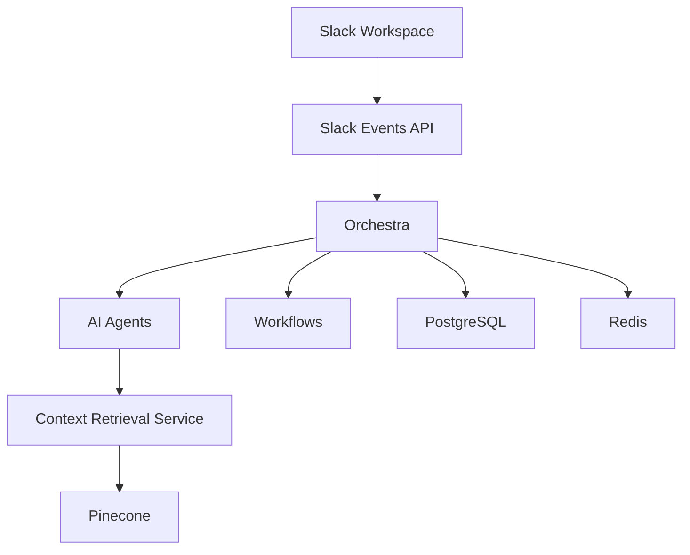
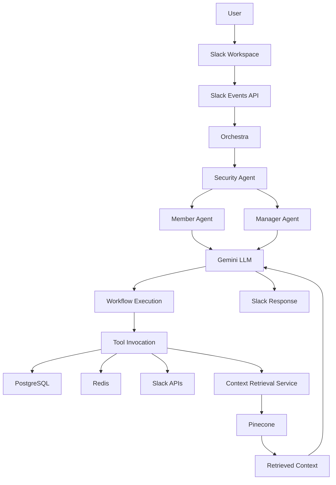
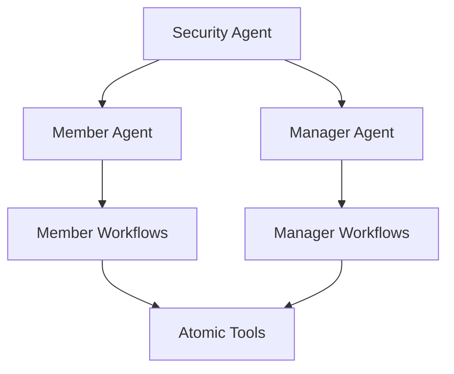

# 🎼 Orchestra


> **An AI-powered Slack project assistant that automates project management through natural language interactions.**

Orchestra is a conversational project assistant built for Slack that enables teams to manage projects, retrieve project knowledge, and perform administrative tasks through natural language. Instead of relying on predefined Slack commands, users interact with the assistant conversationally, while the system coordinates AI agents, workflows, and backend services to execute project operations.

The project follows a modular architecture consisting of a **Node.js orchestration service** and a dedicated **context retrieval service**. The orchestration layer manages Slack integration, business logic, AI-driven orchestration, security, and workflow execution, while the context retrieval service is responsible for document ingestion, context management, vector storage, and semantic retrieval.

---

# 🎯 Motivation

Project management within Slack often relies on predefined commands, fragmented information, and manual coordination, making interactions less intuitive as projects grow. Orchestra addresses these challenges by combining conversational AI, deterministic workflows, and project-specific knowledge retrieval into a unified assistant capable of understanding and executing project operations through natural language.

---

# ✨ Features

### 🤖 Natural Language Interaction

Interact with Orchestra using plain English instead of memorizing Slack commands. The assistant interprets user requests and executes the required project management operations through AI-powered workflows.

### 📚 Context-Aware Knowledge Retrieval

Retrieve answers grounded in project-specific documents rather than relying solely on general LLM knowledge.

### 👥 Conversational Project Management

Manage projects, channels, members, documents, and project updates directly through conversational interactions.

### 🔒 Role-Based Access Control

Different capabilities are available to project members and project managers, ensuring users only access operations and information they are authorized to use.

### 🔄 Project Knowledge Synchronization

Keep project knowledge synchronized by ingesting new documents and project updates while preserving existing project context.

---

# 🏗️ High-Level Architecture

Orchestra follows a modular two-service architecture, separating orchestration from context management so that each service focuses on a well-defined responsibility.



## Orchestration Service

The primary backend responsible for:

- Slack Events API integration
- AI-driven orchestration
- Business logic execution
- Workflow execution
- Tool invocation
- Project and user management
- Cache management
- Communication with the Context Retrieval Service

## Context Retrieval Service

A dedicated backend responsible for:

- Document ingestion
- Context updates
- Semantic retrieval
- Context deletion
- Vector database interactions

This separation allows the orchestration layer to focus on decision making while the retrieval service specializes in maintaining and retrieving project knowledge.

---

# 🔄 Request Flow

A typical request follows the workflow below.



Depending on the user's request, the selected agent executes one or more predefined workflows. These workflows invoke the required tools to interact with Slack, the database, cache, or the Context Retrieval Service before generating the final response.

For a more detailed explanation of Orchestra's architecture, refer to the documentation available in the **docs/** directory.

---

Before diving into the internal architecture, it is helpful to understand the principles that guided Orchestra's design.

# 💭 Design Philosophy

Orchestra is designed around a few core principles that guide the overall architecture.

- **Separation of Concerns** — Business logic and context management are isolated into independent services.
- **Deterministic Execution** — Frequently used operations are encapsulated into reusable workflows instead of relying entirely on language model reasoning.
- **Composable Components** — Small, reusable tools can be combined to build more complex project management operations.
- **Security by Design** — Authorization and permission checks are enforced before any operation is executed.
- **Maintainability** — Modular components allow the system to evolve without tightly coupling different responsibilities.

---

# 🏛️ Architecture Decisions

Orchestra combines specialized AI agents, deterministic workflows, and modular tools to execute project operations in a structured, secure, and maintainable manner.

## 🤖 Multi-Agent Architecture



The orchestration layer consists of three specialized agents, each responsible for a different stage of request execution.

### Security Agent

The Security Agent is the entry point for every request.

Responsibilities include:

- Resolving project context
- Verifying project membership
- Determining user permissions
- Preventing unauthorized operations
- Selecting the appropriate execution path

Only authenticated and authorized requests proceed further into the system.

### Member Agent

The Member Agent handles operations available to project members.

Typical responsibilities include:

- Answering project-related questions
- Retrieving project knowledge
- Accessing public project documents

The agent is intentionally restricted to member-level workflows and tools.

### Manager Agent

The Manager Agent handles administrative project operations.

Typical responsibilities include:

- Project management
- Channel management
- Member management
- Document ingestion
- Project updates

The manager agent primarily relies on predefined workflows and invokes lower-level tools only when additional flexibility is required.

## ⚙️ Workflow-Based Execution

Rather than allowing the language model to determine every execution path, commonly performed operations are implemented as deterministic workflows.

This approach provides:

- Consistent execution
- Reduced reasoning overhead
- Lower latency
- Improved reliability

Each workflow coordinates multiple tools to complete a specific project management task while abstracting implementation complexity from the language model.

## 🛠️ Modular Tool Architecture

The orchestration layer exposes a collection of atomic tools, each responsible for performing a single operation.

Tools are grouped according to the systems they interact with.

- Database Tools
- Slack Tools
- Context Retrieval API Tools
- File Tools

Keeping tools atomic improves maintainability, simplifies testing, and allows workflows to compose multiple operations when required.

## ⚡ Performance Optimizations

Several architectural decisions were made to improve system responsiveness and reduce unnecessary operations.

### Efficient Data Access

- Redis caching for frequently accessed project information
- Optimized database queries supporting batched operations

### Optimized Execution

- Concurrent processing for selected workflows using semaphores
- Reduced API calls through workflow orchestration
- Separation of orchestration and retrieval into dedicated backend services

## 🔒 Security

Security is enforced throughout the request lifecycle.

Current implementation includes:

- Project-level authorization
- Role-based access control
- Permission-aware document retrieval
- Support for private project knowledge
- Authorization before workflow or tool execution

These mechanisms ensure users can only perform operations and access information permitted by their project role.

# 📁 Project Structure

The repository is organized around modular components, with each directory responsible for a distinct aspect of Orchestra's orchestration layer.

```text
.
├── ai/                  # AI agent orchestration and execution
├── prisma/              # Database schema and migrations
├── prompts/             # System prompts and tool prompts
├── redis/               # Redis cache configuration
├── services/
│   └── db/              # Database client and related services
├── slack/               # Slack Events API integration
├── tools/               # Atomic tools grouped by functionality
├── workflows/           # Deterministic workflows coordinating multiple tools
├── docs/                # Project documentation
├── app.js               # Application entry point
├── package.json
├── .env.example         # Example environment variables
└── prisma.config.js
```

## Directory Overview

| Directory | Purpose |
|-----------|---------|
| **ai/** | AI agent orchestration, routing, and execution logic. |
| **prisma/** | Prisma schema, migrations, and database configuration. |
| **prompts/** | System prompts used by the orchestration layer. |
| **redis/** | Redis client and cache configuration. |
| **services/** | Shared backend services such as database initialization. |
| **slack/** | Slack Events API integration and event processing. |
| **tools/** | Collection of atomic tools responsible for interacting with external systems. |
| **workflows/** | Deterministic workflows composed from multiple tools. |
| **docs/** | Project setup guides, architecture documentation, and additional resources. |

---

# 🛠️ Tech Stack

| Category | Technology |
|----------|------------|
| Runtime | Node.js |
| Backend Framework | Express.js |
| AI Model | Google Gemini |
| Database | PostgreSQL (Neon) |
| ORM | Prisma |
| Cache | Redis |
| Vector Database | Pinecone |
| Slack Integration | Slack Events API |
| Local Development | ngrok |

---

# 🚀 Getting Started

Clone the repository.

```bash
git clone https://github.com/nishantrao03/orchestra.git
cd orchestra
```

Install project dependencies.

```bash
npm install
```

Create the environment file.

```bash
cp .env.example .env
```

Populate the required environment variables.

Generate the Prisma Client.

```bash
npx prisma generate
```

Start the development server.

```bash
npm run dev
```

Detailed setup instructions are available in the **docs** directory.

- 📦 [Installation Guide](docs/installation.md)
- 🔗 [Slack App Configuration](docs/slack-setup.md)
- 🗄️ [Database Setup](docs/database-setup.md)

---

# ⚙️ Environment Variables

Orchestra uses environment variables to configure external integrations and infrastructure.

After copying .env.example during the initial setup, ensure all required API keys and connection strings are correctly populated before starting the application.

---

# 🔗 Orchestra Context Retrieval Service

Orchestra separates orchestration from context management through a dedicated **Context Retrieval Service**.

The service is responsible for:

- Document ingestion
- Context updates
- Semantic retrieval
- Context deletion
- Vector database interactions

The source code is maintained in a separate repository.

➡️ **Repository:** https://github.com/nishantrao03/context_retrieval_service

Refer to that repository for deployment instructions, API documentation, and implementation details.

---

# 🔗 External Services

Orchestra integrates with several external services.

| Service | Purpose |
|---------|---------|
| Slack | Workspace integration and event handling |
| Google Gemini | Conversational reasoning and workflow planning |
| PostgreSQL (Neon) | Persistent application data |
| Redis | High-speed caching |
| Pinecone | Vector storage for semantic retrieval |
| ngrok | Local webhook exposure during development |

---

# 📚 Documentation

Detailed documentation is available in the **docs** directory.

| Document | Description |
|----------|-------------|
| **installation.md** | Local development setup |
| **slack-setup.md** | Slack application configuration |
| **database-setup.md** | Database configuration and Prisma migrations |

---

# 🧪 Testing

The repository includes tests for individual tools and workflows to verify component behavior in isolation during development.

---

# 📄 License

This project is licensed under the MIT License.

See the **LICENSE** file for additional information.